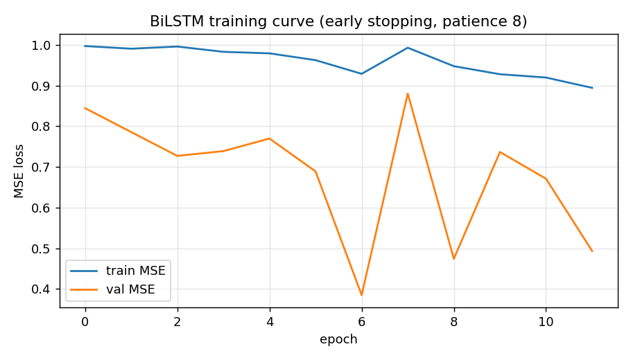
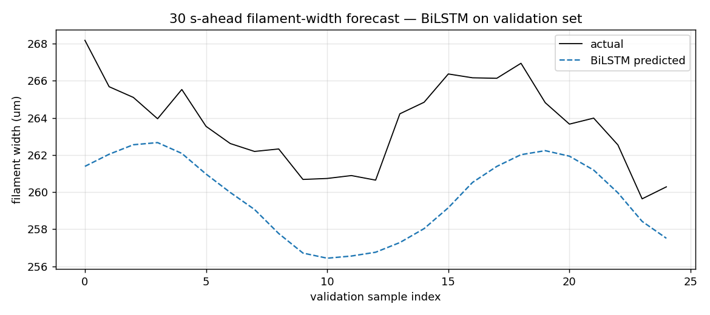
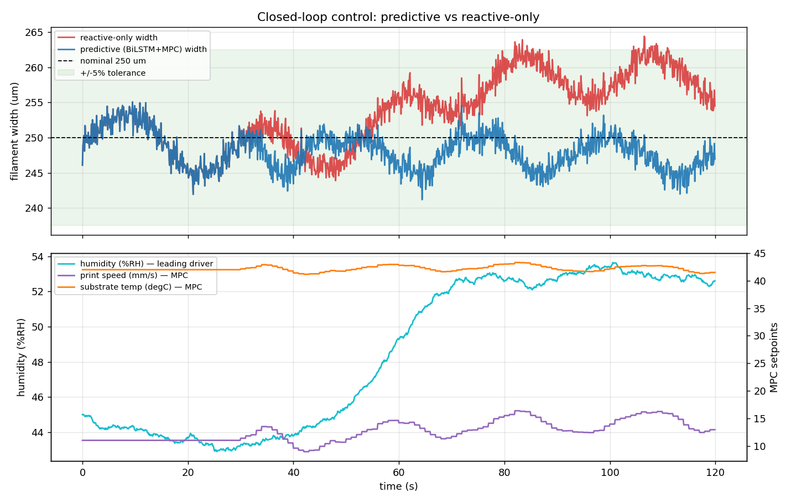
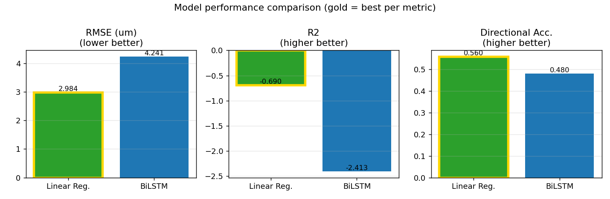

# AI-Enabled Closed-Loop Process Control for Direct Ink Writing of Li-ion Battery Electrodes

## Overview

This project implements an AI-enabled closed-loop control architecture for Direct Ink Writing (DIW) of lithium-ion battery electrodes.

The system combines:

- YOLOv8-based visual inspection
- BiLSTM-based filament width prediction
- Model Predictive Control (MPC)
- Digital Twin closed-loop optimization

The implementation is based on the CE52002 coursework and demonstrates how machine learning and control systems can be integrated to improve manufacturing quality and process stability.

---

## Architecture

### Layer 1 – Visual Inspection
YOLOv8 detects printing defects and triggers corrective actions.

### Layer 2 – Predictive Analytics
BiLSTM predicts future filament-width deviations using time-series process data.

### Layer 3 – Model Predictive Control
MPC computes optimal process parameters while respecting operational constraints.

### Layer 4 – Digital Twin
A virtual representation of the printing process coordinates reactive and predictive control actions.

---

## Project Structure

```text
diw_control/
├── diw/
│   ├── yolo.py
│   ├── bilstm.py
│   ├── mpc.py
│   ├── closed_loop.py
│   ├── preprocess.py
│   └── synthetic.py
├── outputs/
├── main.py
└── requirements.txt
```

---

## Results

### BiLSTM Training



### Forecast vs Actual



### Closed Loop Performance



### Metric Comparison



---

## Technologies Used

- Python
- PyTorch
- YOLOv8
- BiLSTM
- Model Predictive Control (MPC)
- NumPy
- Pandas
- Matplotlib

---

## Author

Abhay Pratap Singh

MSc Artificial Intelligence  
University of Bath
